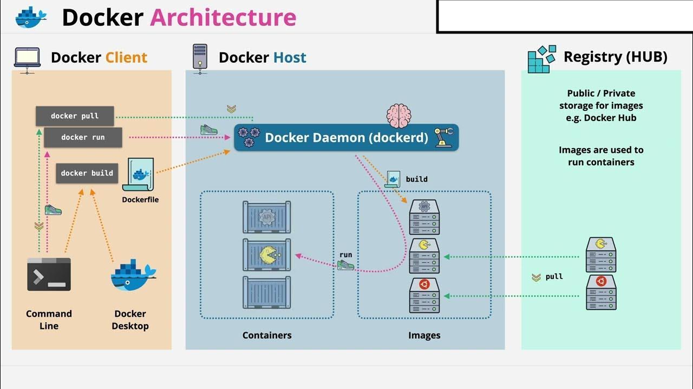
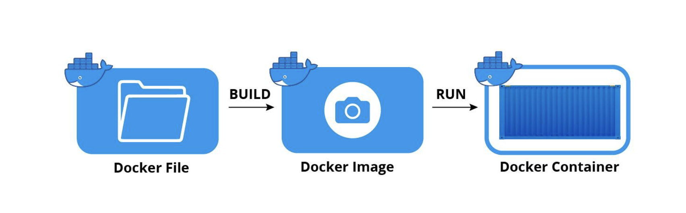
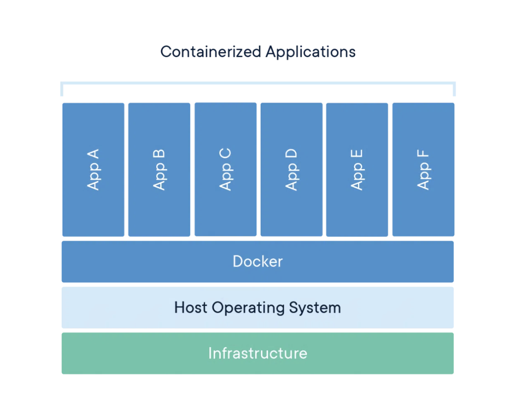

# **Inception**

## **Navigation Table:**

1. [Docker Overview](#docker-overview)
	1. [What is Docker](#what-is-docker)
	1. [Why use Docker](#why-use-docker)
2. [Docker architecture](#docker-architecture)
3. [Docker Compose](#docker-compose)
	1. [Define services in a Compose file](#define-services-in-a-compose-file)
4. [Dockerfile](#dockerfile)
	1. [Structure of a Dockerfile](#structure-of-a-dockerfile)
	1. [Common Instructions in a Dockerfile](#common-instructions-in-a-dockerfile)
	1. [Best Practices for Writing Dockerfiles](#best-practices-for-writing-dockerfiles)
5. [Docker Image](#docker-image)
	1. [How to Build a Docker Image](#how-to-build-a-docker-image)
6. [Docker Container](#docker-container)
7. [Docker Commands](#docker-commands)
	1. [docker build](#docker-build)
	1. [docker run](#docker-run)
	1. [docker pull](#docker-pull)
	1. [docker push](#docker-push)
	1. [docker ps](#docker-ps)
	1. [docker images](#docker-images)
	1. [docker exec](#docker-exec)
	1. [docker rm](#docker-rm)
	1. [docker rmi](#docker-rmi)
	1. [docker stop](#docker-stop)
	1. [docker-compose up](#docker-compose-up)
	1. [docker-compose down](#docker-compose-down)
8. [Docker Networking](#docker-networking)
	1. [Drivers](#drivers)
	
# **Docker Overview**

## **What is Docker**

Docker is an open source platform that enables developers to build, deploy, run, update and manage containers—standardized, executable components that combine application source code with the operating system (OS) libraries and dependencies required to run that code in any environment.

## **Why use Docker**

There are several key reasons why developers and organizations choose to use Docker:

1. Consistency: Docker ensures consistency across different environments, from development to production. Since Docker containers encapsulate all the dependencies and configuration required to run an application, you can be confident that your application will behave the same way regardless of where it is deployed.

2. Isolation: With the help of namespaces Docker containers provide lightweight, isolated environments for running applications, restricting a process's access or visibility into other resources or areas of the system.

3. Portability: Docker containers are portable and can be easily moved between different environments and platforms.

4. Efficiency: Docker promotes efficient resource utilization by running applications in lightweight containers. Containers share the host system's kernel and only include the necessary dependencies, resulting in faster startup times, lower memory footprint, and improved scalability compared to traditional virtual machines.

5. Flexibility: Docker provides a flexible and modular approach to building and deploying applications. Like what we've been asked during "Inception Project" you can compose complex applications from multiple containers, each serving a specific purpose, and easily scale individual components as needed.

6. Dependency Management: Docker helps resolve dependency conflicts by encapsulating dependencies within containers and providing isolation between containers. If different applications require conflicting versions of the same library or package, they can each be packaged into separate Docker containers with their own dependencies, allowing them to coexist peacefully without interfering with each other.

# **Docker architecture**



# **Docker Compose**

Docker Compose is a tool for defining and running multi-container applications. It is the key to unlocking a streamlined and efficient development and deployment experience.

Compose simplifies the control of your entire application stack, making it easy to manage services, networks, and volumes in a single, comprehensible YAML configuration file. Then, with a single command, you create and start all the services from your configuration file.

## *Define services in a Compose file*

1. Ex:

```yaml
services:
  nginx:
    build:
      context: .
      dockerfile: requirements/nginx/Dockerfile
    container_name: nginx
    depends_on:
      - wordpress
    ports:
      - "443:443"
    networks:
      - inception
    volumes:
      - wordpress_v:/var/www/html
    restart: on-failure
```

[For more infos on docker compose …](https://docs.docker.com/compose/compose-file/build/)

# **Dockerfile**

A Dockerfile is a straightforward text file containing a collection of commands or procedures. These commands and guidelines we run act on the base image configured to create a new Docker image. A Dockerfile is the Docker image’s source code. A Dockerfile is a text file containing various instructions and configurations. The FROM command in a Dockerfile identifies the base image from which you are constructing.

When you run the Docker run command, Docker uses this file to build the image itself. 
NB: **Docker image**=> read-only templates that contain instructions for creating a container.
## **Structure of a Dockerfile**

1. *Base Image*: The Dockerfile typically starts with a FROM instruction that specifies the base image to use as the starting point for building the Docker image. This can be an official image from Docker Hub or a custom image built by another Dockerfile.
2. *Instructions*: The Dockerfile contains a series of instructions that define the steps needed to build the Docker image. These instructions include commands for installing dependencies, copying files into the image, setting environment variables, and configuring the container.
3. *Build Context*: The Dockerfile operates in the context of a build directory known as the build context. Any files or directories referenced in the Dockerfile are relative to the build context. It's important to keep the Dockerfile and any necessary files within the build context to ensure they are accessible during the build process.

## **Common Instructions in a Dockerfile**

1. **FROM**: Specifies the base image to use for the Docker image.

```bash
FROM debian:alpine
```

2. **RUN**: Executes commands in the Docker image during the build process.

```bash
RUN apt-get update && apt-get install -y \
    package1 \
    package2
```

3. **COPY / ADD**: Copies files or directories from the build context into the Docker image.

```bash
COPY requirements/nginx/tools/ /etc/nginx/ssl
```

4. **WORKDIR**: Sets the working directory for subsequent instructions in the Dockerfile.

```bash
WORKDIR /var/www
```

5. **ENV**: Sets environment variables in the Docker image.

```bash
ENV DOMAIN_NAME=login.42.fr
```

6. **EXPOSE**: Specifies ports to expose from the Docker container to the host.

```bash
EXPOSE 443
```

7. **CMD / ENTRYPOINT**: Specifies the command to run when the Docker container starts.

```bash
CMD ["bash", "script.bash"]
```
## **Best Practices for Writing Dockerfiles**

After discussing the structure as well as common instructions of Dockerfile we come to focus a little bit on some optimal methods for writing Dockerfiles

1. *Use Official Images*: Whenever possible, use official Docker images from Docker Hub as the base image for your Dockerfile. Official images are well-maintained, secure, and regularly updated.
2. *Layer Caching*: Order your Dockerfile instructions to maximize layer caching. Place instructions that are less likely to change near the top of the Dockerfile and instructions that are more likely to change near the bottom to take advantage of Docker's layer caching mechanism.
3. *Minimize Layers*: Minimize the number of layers in your Docker image by combining related commands into single RUN instructions. This helps reduce the size of the final Docker image and improves build performance.
4. *Cleanup*: Clean up temporary files and dependencies after installation to reduce the size of the Docker image. Use apt-get clean or rm -rf /var/lib/apt/lists/* to remove package cache files.
5. *Use .dockerignore*: Create a .dockerignore file to exclude unnecessary files and directories from the build context. This helps reduce the build time and size of the Docker image by excluding files that are not needed in the final image.

# **Docker Image**

Docker images are the fundamental building blocks in Docker, serving as read-only blueprints that contain container-creation instructions. Think of an image as a snapshot of what will be inside a container when it's running.

Each image consists of multiple layers, akin to layers in a photo editor, each contributing to the overall environment. These layers encompass the application's code or binary, runtimes, libraries, and other filesystem items. However, it's important to note that Docker images are dependent on the core host operating system (OS).

To create a Docker image, you typically start with a base image that includes an OS, such as Debian Linux, and then build upon it by installing additional software or configuring settings. This process can be done manually using a Dockerfile, a text document containing all the instructions needed to generate the image, or by pulling images from a central repository like Docker Hub.

When a Docker user runs an image, one or more container instances are created. Containers can be tailored to specific needs, such as hosting a web server or running a bash shell. However, most images come preloaded with software and configuration files.

It's important to understand that Docker images are immutable, meaning they cannot be altered once created. If modifications are necessary, a new container with the desired changes should be created and saved as a separate image.


## **How to Build a Docker Image**

Building a Docker Image 

*Method of Interaction*:
Docker images can be built interactively, allowing users to launch a container from an existing Docker image and make necessary modifications to the environment before saving the image. This interactive method is the most straightforward approach to constructing Docker images.

Begin by running Docker and opening a terminal window.
Start Docker using the command `docker run <image_name>:
<tag_name>`. This initiates a shell session within the container derived from the specified image. If no tag name is specified, Docker utilizes the latest version of the image.
3. The resulting image should then be saved for future use.

*Dockerfile Method*:
Alternatively, Docker images can be built using a Dockerfile, a text file containing the commands needed to construct the image. While this method may be more complex and time-consuming, it is preferred in contexts with continuous delivery pipelines.

Begin by creating a Dockerfile and adding the necessary commands to build the image.
Create a .dockerignore file to exclude any unnecessary files from the final build.
Utilize the docker build command to generate the Docker image, assigning it a name and tag for identification.

```bash
docker build [OPTIONS] PATH | URL | -
```


# **Docker Container**

A container is an isolated environment for your code. This means that a container has no knowledge of your operating system, or your files.
Because of the isolation that containers provide, they are well-suited for securely running software like databases or web applications that need access to sensitive resources, without giving access to every user on the system.

Since the container runs natively on Linux and shares the host machine’s kernel, it is lightweight, so it doesn’t use more memory than other executables. If you stop a container, it will not automatically restart unless you configure it that way. However, containers can be much more efficient than virtual machines because they don’t need the overhead of an entire operating system. They share a single kernel with other containers and boot in seconds instead of minutes.



# **Docker Commands**
- *Here some docker commands frequently used*

## *docker build*:Build a Docker image from a Dockerfile.
* **Purpose**: Creates a Docker image based on the instructions specified in a Dockerfile.

* **Usage**
```bash
docker build -t myapp .
```

## *docker run*: Run a Docker image as a container.
* **Purpose**: Starts a container from a Docker image.

* **Usage**
```bash
docker run -d --name mycontainer myapp:latest
```

## *docker pull*: Pull a Docker image from a registry.
* **Purpose**: Downloads a Docker image from a registry such as Docker Hub.

* **Usage**
```bash
docker pull debian:bullseye
```

## *docker push*: Push a Docker image to a registry.
* **Purpose**: Uploads a Docker image to a registry such as Docker Hub.
* **Usage**
```bash
docker push myusername/myimage:tag
```

## *docker ps*: List running containers.
* **Purpose**: Displays a list of containers that are currently running.
* **Usage**
```bash
docker ps
```

## *docker images*: List Docker images.
* **Purpose**: Shows a list of Docker images that are currently stored on the local machine.
* **Usage**
```bash
docker images
```

## *docker exec*: Execute a command inside a running container.
* **Purpose**: Runs a command inside a running container.
* **Usage**
```bash
docker exec -it mycontainer bash
```

## *docker rm*: Remove one or more containers.
* **Purpose**: Deletes one or more containers from the local machine.
* **Usage**
```bash
docker rm mycontainer
```
## *docker rmi*: Remove one or more images.
* **Purpose**: Deletes one or more Docker images from the local machine.
* **Usage**
```bash
docker rmi myimage:tag
```

## *docker stop*: Stop one or more running containers.
* **Purpose**: Stops one or more running containers.
* **Usage**
```bash
docker stop mycontainer
```


## *docker-compose up*: Create and start Docker containers defined in a docker-compose.yml file.
* **Purpose**: Builds, (re)creates, starts, and attaches to containers for a service.
* **Usage**
```bash
docker-compose up
```

## *docker-compose down*: Stop and remove Docker containers defined in a docker-compose.yml file.
* **Purpose**: Stops and removes containers, networks, volumes, and images created by docker-compose up.
* **Usage**
```bash
docker-compose down
```

# **Docker Networking**

- Docker networking allows containers to communicate with each other and with the outside world. It provides several networking modes and features to facilitate communication between containers and other networked entities.

## *Drivers*

| Driver         | Description |
| :---------     | :---------- |
| ```bridge```   | *The default network driver*.
| ```host```     | *Remove network isolation between the container and the Docker host.*
| ```none```     | *Completely isolate a container from the host and other containers.*
| ```overlay```  | *Overlay networks connect multiple Docker daemons together.*
| ```ipvlan```   | *IPvlan networks provide full control over both IPv4 and IPv6 addressing.*
| ```macvlan```  | *Assign a MAC address to a container.*